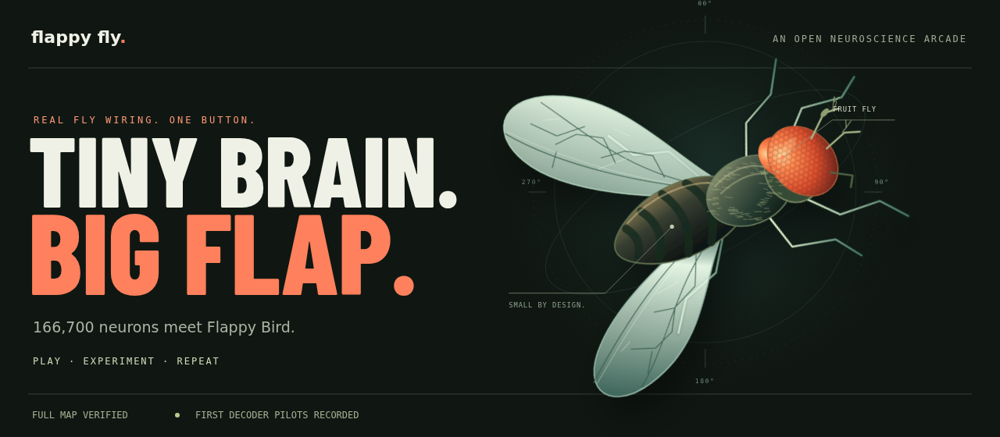
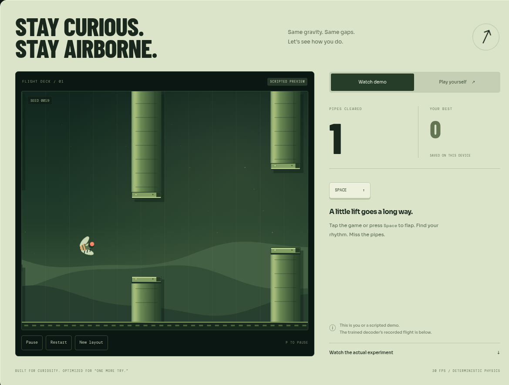
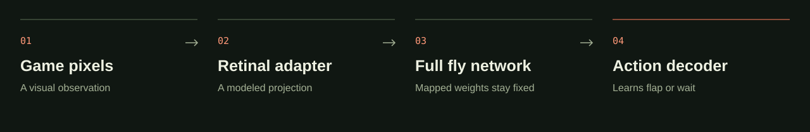

<p align="center">
  <a href="https://jackspiece.github.io/flappy-fly/">
    
  </a>
</p>

<p align="center">
  <a href="https://jackspiece.github.io/flappy-fly/"><strong>Enter the arcade ↗</strong></a>
  &nbsp; · &nbsp;
  <a href="https://jackspiece.github.io/flappy-fly/#learning">Watch a decoder flight</a>
  &nbsp; · &nbsp;
  <a href="notes/LEARNING.md">Read the method</a>
  &nbsp; · &nbsp;
  <a href="CONTRIBUTING.md">Build with us</a>
</p>

<p align="center">
  <a href="https://github.com/jackspiece/flappy-fly/actions/workflows/checks.yml"></a>
  
  
</p>

## A tiny brain. A big question.

What happens when a fruit fly’s mapped wiring meets Flappy Bird?

Flappy Fly puts the **complete retained MaleCNS network** inside an approximate spiking
simulator, shows it game frames, and trains a small action decoder from its neural
activity. The experiment is public: code, failures, checkpoints, and measurements
included.

> **Field note · September 11, 2026**
>
> The full map runs on a standard GitHub CPU runner. Two decoder pilots have completed.
> **Pilot 02 cleared zero pipes on all three unseen test layouts.** The first reliable
> flight is still an open problem.

The mapped synaptic weights stay **fixed** in these pilots. Learning happens in the
decoder. This is not a reconstruction of a living fly, and it does not yet show that fly
wiring is better than simpler AI.

## Your turn, human.

<a href="https://jackspiece.github.io/flappy-fly/#arcade">
  
</a>

**[Play in your browser →](https://jackspiece.github.io/flappy-fly/#arcade)** Tap or
press **Space** to flap. **P** pauses. Try another seeded layout and beat your own best
score.

The main arcade uses manual controls or a **scripted demo**. The separate
[recorded decoder flight](https://jackspiece.github.io/flappy-fly/#learning) replays an
actual evaluation. The full neural simulator runs in Python and C++.

## Under the exoskeleton



| Part                  | What it does                                                                                                       |
| --------------------- | ------------------------------------------------------------------------------------------------------------------ |
| **Observation**       | High-contrast game pixels drive an explicit retinal adapter.                                                       |
| **Full retained map** | Simulates 166,700 neurons and 25,582,938 directed, weighted connections.                                           |
| **Features**          | Photoreceptor spike grids, anatomical population rates, activity changes, and the controller’s own action history. |
| **Learning**          | A 48-unit hidden-layer decoder learns **flap** or **wait** through imitation and dataset aggregation.              |
| **Evaluation**        | Separate training, validation, and test layouts; the first test seed always supplies the replay.                   |

Bird position, pipe coordinates, velocity, and the teacher’s decision do not enter the
decoder inputs. The privileged teacher supplies training labels.

“Full” refers to the upstream **retained network**: assigned neuronal superclasses,
including weak and self connections, excluding glia and unresolved objects. It does not
mean every object in the raw reconstruction. The visual adapter, dynamics, and decoder
are modeling choices.

[Read the learning method](notes/LEARNING.md) · [Inspect the neural source](fly_neural/)
· [Check the data provenance](notes/CREDITS.md)

## Every flight counts

The latest pilot collected **6,212** full-network training examples. The selected
checkpoint was fitted on **5,292** examples, chosen using policy-validation layouts
before the three held-out tests.

| Controller                         | Mean pipes | Mean frames alive |
| ---------------------------------- | ---------: | ----------------: |
| **Learned decoder · pilot 02**     |   **0.00** |          **58.0** |
| Random flaps                       |       0.00 |              75.3 |
| Periodic flaps                     |       0.00 |              87.0 |
| Scripted teacher, privileged state |       9.00 |             600.0 |

Seeds: **9101, 9102, 9103**. Each episode is capped at 600 frames. The teacher has
access to game state, so its score is a reference, not a matched architecture
comparison. Three layouts are only a preliminary check.

- [Pilot 02: report, checkpoint, and replay](experiments/pilot-02/)
- [Pilot 01: the original result, preserved](experiments/pilot-01/)
- [Experiment log and interpretation](experiments/README.md)
- [Completed learning run](https://github.com/jackspiece/flappy-fly/actions/runs/34625990529)

## Full map. Modest machine.

Measured on a standard Ubuntu x86-64 GitHub runner, with no GPU:

| Measurement                            |                    Result |
| -------------------------------------- | ------------------------: |
| Retained neurons                       |                   166,700 |
| Directed, weighted connections         |                25,582,938 |
| Core graph arrays                      |                196.45 MiB |
| Peak neural-process RAM                | **930.78 MiB / 0.91 GiB** |
| Peak preparation child-process RAM     |   1,596.76 MiB / 1.56 GiB |
| Mean wall time per 10 ms neural window |              **27.41 ms** |
| Original benchmark workflow duration   |                48 seconds |

Six timed samples after 100 ms of warmup, with learning disabled. This measures runtime
feasibility, not training convergence or sustained throughput.

[Raw measurements and tested commit](benchmarks/2026-09-11-github/) ·
[Inspect individual samples](https://jackspiece.github.io/flappy-fly/#evidence) ·
[Benchmark run](https://github.com/jackspiece/flappy-fly/actions/runs/34622807743)

## Open the lab

### Preview the arcade

The site has no runtime dependencies or build step:

```sh
git clone https://github.com/jackspiece/flappy-fly.git
cd flappy-fly
python -m http.server 8000 --directory docs
```

Open **http://localhost:8000**. The arcade works on phones and desktops, supports
keyboard and touch, respects reduced motion, and keeps your best score on your device.

### Reproduce the full-network pilot

Use **Python 3.12+**, a **C++17 compiler**, and the packages below. Data preparation
downloads about **1.11 GB** and needs additional working space. Source files and
compiled arrays are verified against pinned hashes.

```sh
python -m pip install -r requirements.txt
python -m unittest discover -s tests -v
python scripts/prepare_data.py
python scripts/benchmark.py
python scripts/train_pilot.py --wall-seconds 720 --rounds 2 --seed-offset 100
```

For an archived pilot, use the source commit in its `run.json`; feature schemas can
change. Checkpoints are loaded with `allow_pickle=False`.

The manual **Learning pilot** and **Full fly map benchmark** workflows run on GitHub
Actions with a 20-minute job limit. Learning uploads reports and checkpoints; the large
dataset stays out of the repository. Ordinary CI runs small verification checks without
downloading the full map.

<details>
<summary><strong>Run the small synthetic integration check</strong></summary>

```sh
python scripts/benchmark.py --synthetic --output results/synthetic-scale.json
```

This deliberately synthetic graph exercises storage and the native integration. Its
runtime does not predict the real network’s runtime.

</details>

## Make the next discovery

Useful next experiments include testing what the retina retains, comparing matched
simpler and shuffled networks, and evaluating across more held-out layouts. Better
decoder classification alone is not enough: the controller has to stay airborne.

Have a hypothesis?
[Propose an experiment](https://github.com/jackspiece/flappy-fly/issues/new/choose).
Want to improve the arcade or reproduce a result? Start with
[CONTRIBUTING.md](CONTRIBUTING.md).

```text
docs/          The playable arcade and measured-result explorer
flappy_fly/    Deterministic game, neural adapter, and decoder
fly_neural/    Pinned upstream neural source and provenance
scripts/       Data preparation, training, and verification
experiments/   Archived pilot reports, checkpoints, and replays
benchmarks/    Recorded full-map runtime measurements
```

## Built on patient science

The MaleCNS release comes from **HHMI Janelia, Google Research, and their
collaborators**. Neural simulation code is pinned from
[`nftechie/stonkfly`](https://github.com/nftechie/stonkfly) at
`78ef3e05ab0fa086032098558d893667068944a0`, with its MIT attribution retained.

[Complete credits, data sources, and licenses →](notes/CREDITS.md)

<p align="center"><sub>An independent community experiment. Keep flapping. Keep questioning.</sub></p>
